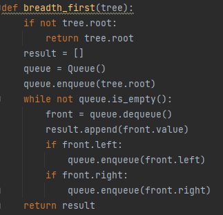

### Challenge
Write a function called breadth first that takes a tree as an argument and return a list of all values in the tree.

### Whiteboard process:
.jpg)

## Approach & Efficiency
Time complexity: Big O(n)
Space complexity: Big O(n)

### Solution

