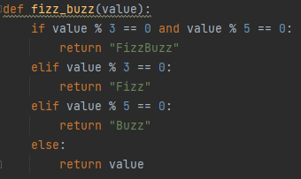
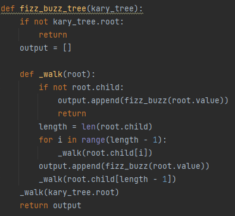

### Challenge
Conduct “FizzBuzz” on a k-ary tree while traversing through it to create a new tree.

### Whiteboard process:
.jpg)

## Approach & Efficiency
Time complexity: Big O(n)
Space complexity: Big O(n)

### Solution

