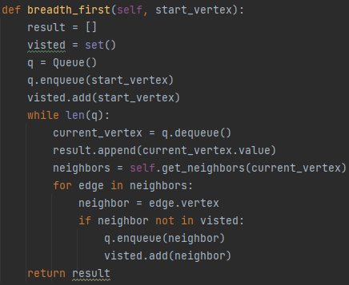

## Challenge:
Write breadth first method for the Graph class:
- Arguments: Node
- Return: A collection of nodes in the order they were visited.
- Display the collection

### Whiteboard process

### Approach and efficiency
- Time complexity: Big O(n^2)
- Space complexity: Big O(n)

### Solution

