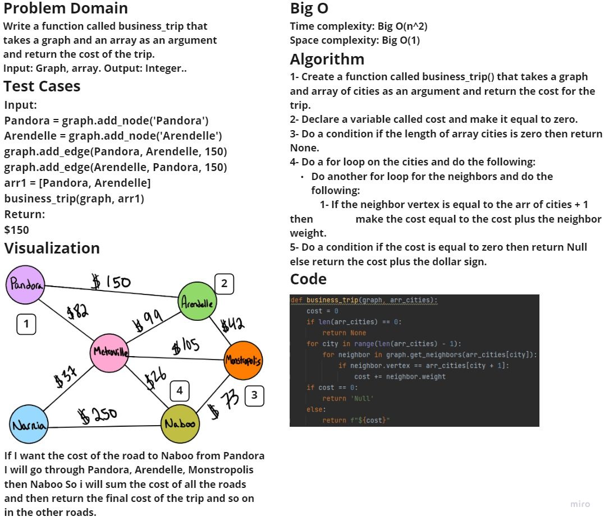
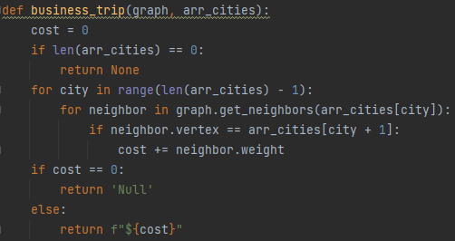

# Challenge Summary
Write a function called business trip
- Arguments: graph, array of city names
- Return: the cost of the trip (if it’s possible) or null (if not)

## Whiteboard Process

## Approach & Efficiency
- Time complexity: Big O(n^2)
- Space complexity: Big O(1)

## Solution

