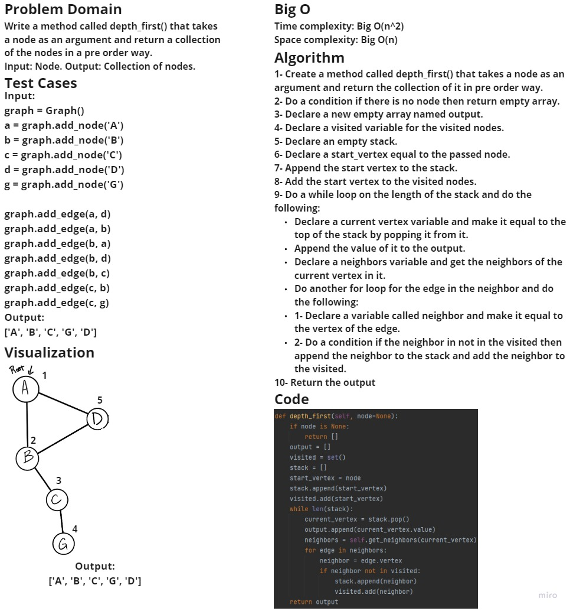
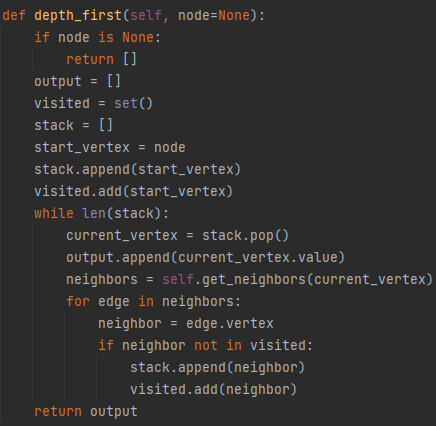

# Challenge Summary
Write the following method for the Graph class:
- Name: Depth first
- Arguments: Node (Starting point of search)
- Return: A collection of nodes in their pre-order depth-first traversal order
- Program output: Display the collection

## Whiteboard Process

## Approach & Efficiency
- Time complexity: Big O(n^2)
- Space complexity: Big O(n)

## Solution

