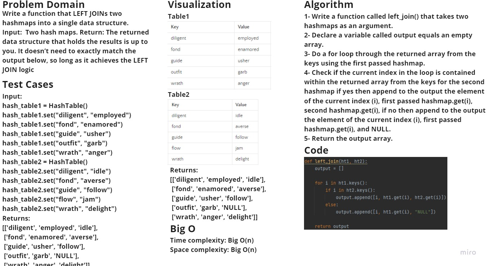

# Hashmap LEFT JOIN
Left Join is a term used in databases, which means comparing two tables and then returns all rows from the left table,
and the matching rows from the right table. The result is NULL from the right side, if there is no match.

## Challenge
Write a function that LEFT JOINs two hashmaps into a single data structure.

## Approach & Efficiency
- Time complexity: Big O(n) because there is a liner iteration involved.
- Space complexity: Big O(n) because of the array that has been created to store the returned output.

## Solution

