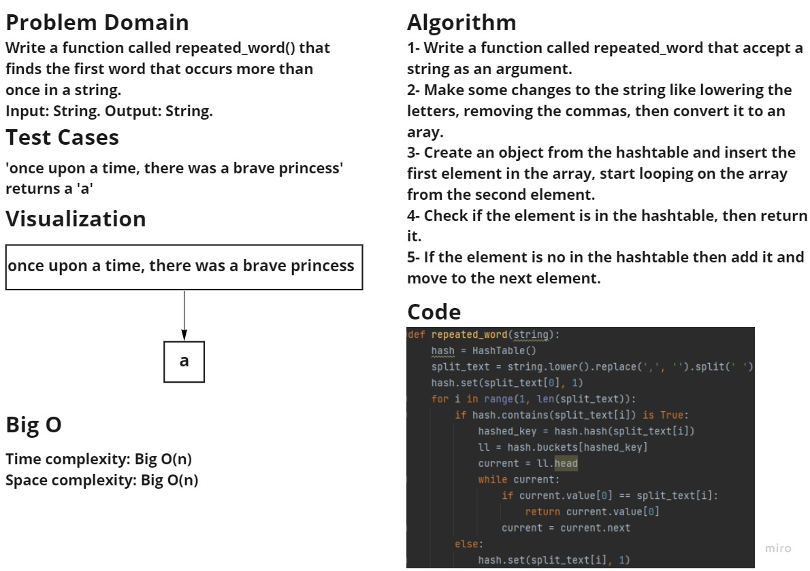

### Challenge summary  
Write a function called repeated_word() that finds the first word that occurs more than once in a string.

### Whiteboard process

### Approach & Efficiency
Time complexity: Big O(n).
Space complexity: Big O(n).

### Solution
To run the code enter "python .\hashmap_repeated_word\hashmap_repeated.py"
To run the tests enter "pytest .\tests\test_repeated_word.py"