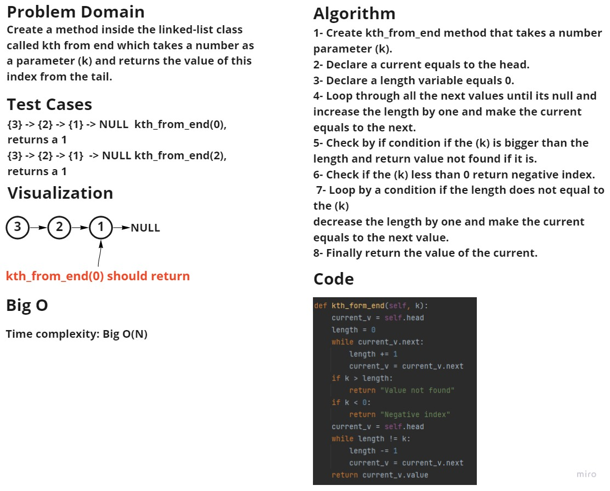

# Singly Linked List

A singly linked list can be traversed in only one direction from head to the last node (tail). Each element in a linked list is called a node. A single node contains data and a pointer to the next node.

## Challenge:

Create a linked list class and include a head property and the class has methods like (insert, includes, toString) 

## Challenge 2:

append: adds a new node with the given value to the end of the list
insert before: adds a new node with the given new value immediately before the first node that has the value specified
insert after: adds a new node with the given new value immediately after the first node that has the value specified

## Challenge 3:

kth_from_end: a method inside the LinkedList class which takes a number as a parameter (k) 
and returns the value of this index from the tail. 

## Whiteboard

**Kth_from_end**

## Approach & Efficiency

Time complexity: 
- insert: Big O(1) 
- includes: Big O(N) 
- toString: Big O(N) 
- append: Big O(N) 
- insert before: Big O(N)  
- insert after: Big O(N)
- kth from end: Big O(N)

the list, the insert after method inserts a value after a specific element, the kth from end method which returns
the node value from the tail of the linked-list.

## API

- Insert: To insert values.
- Include: To check if a specific value exists in the list.
- Tostring: To print the list in a formatted way.
- Append: add to the last.
- Insert_before: to add an element before a specific element.

