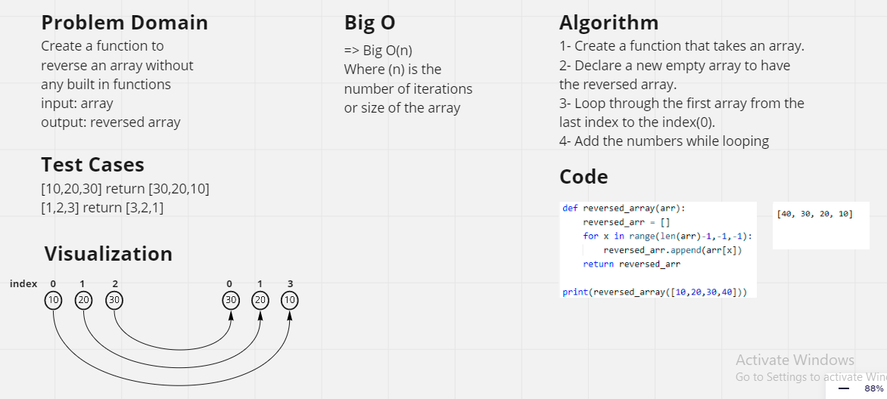

# Reverse an Array
**Write a function called reverseArray which takes an array as an argument. Without utilizing any of the built-in methods available to your language, return an array with elements in reversed order.**

## Whiteboard Process

## Approach & Efficiency
We need to print the elements of the array in reverse order that is; the last element should be displayed first, followed by second last element and so on. We can solve this problem using range of the length of the array, by first declaring and initializing an array, second looping through the array in reverse order that is, the loop will start from (length of the array - 1) and end at 0 by decreasing the value of x by 1, third printing the element arr[x] in each iteration.

Time complexity: O(N) where N is the number of elements present in the array. Here we run one loop for N/2 times.
Space Complexity: O(1) because we don’t use any auxiliary space we just use start and end variables to swap the array.