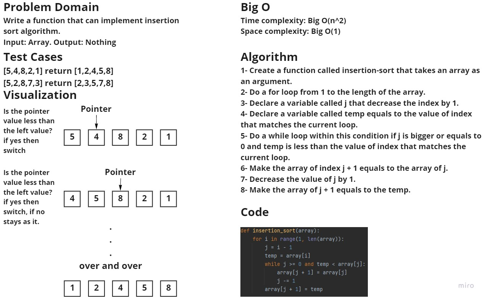

### Challenge
Write a function that can implement insertion sort algorithm.

### Whiteboard process:

## Approach & Efficiency
Time complexity: Big O(n^2)
Space complexity: Big O(1)

### Solution
In order to run the code enter "python .\sorting\insertion\insertion.py"
In order to run the tests enter "pytest .\tests\test_insertion_sort.py"
