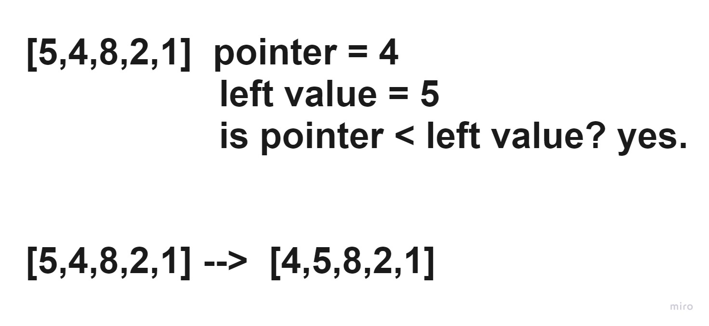

### Insertion Sort
Insertion sort is a sorting algorithm that places each element in the array in its suitable place in each iteration, 
the array is virtually split into a sorted and an unsorted part, values from the unsorted part are picked and placed
at the correct position in the sorted part.

#### Trace
Sample array: [5,4,8,2,1]

In each iteration we should pick a pointer, in the first one it will be the value of index 1, because we need to compare it to the value to it's left which is the value of index 0, after that in each iteration we will be going to take the pointer index + 1 as a new pointer.

Iteration 1:

In the first iteration we look if the pointer value is less than the value to it's left, if yes we will swap them, and in this iteration the pointer was less than the left value, so they have been swapped.

Iteration 2:

In this iteration we will take the pointer of index + 1 as a new pointer, and compare it to it's left value, which in this iteration isn't less than the pointer, meaning it will stays as it, and go for the next iteration as the elements we have checked until now are sorted.

Iteration 3:

In this iteration the pointer is less than the left value so, we swapped them, and after checking the new left value we found that the pointer is also less than the new left value, so we swapped again, then after checking again we found that the pointer is less again so we swapped, and finally when we checked the left value was less than the pointer, so we will stop and go to the next iteration.

Iteration 4:

At this iteration the pointer reached to the last element, so this is the last iteration, we found that the pointer is less than the left value in its first, second, and third iterations, so we will swap each one of them until we reach the 4th iteration where the pointer is not less than the left value, and that's where we will stop because there is no more elements to go over and the loop has reached its break condition.

