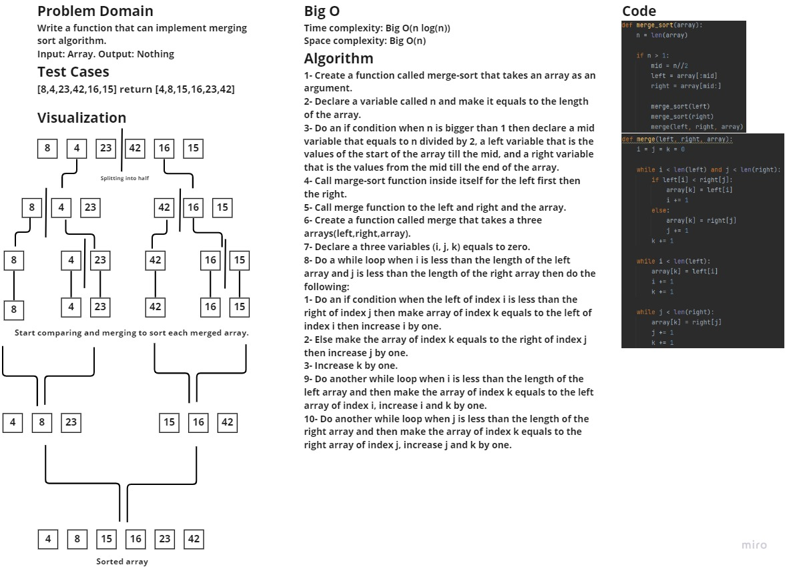

### Challenge
Write a function that can implement merge sort algorithm.

### Whiteboard process:

## Approach & Efficiency
Time complexity: Big O(n log(n))
Space complexity: Big O(n)

### Solution
In order to run the code enter "python .\sorting\merge\merge.py"
In order to run the tests enter "pytest .\tests\test_merge_sort.py"
