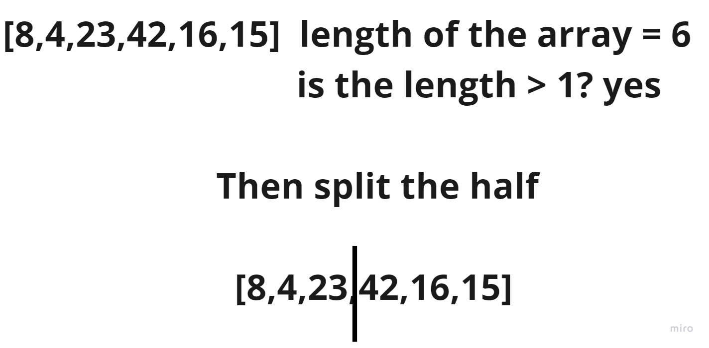
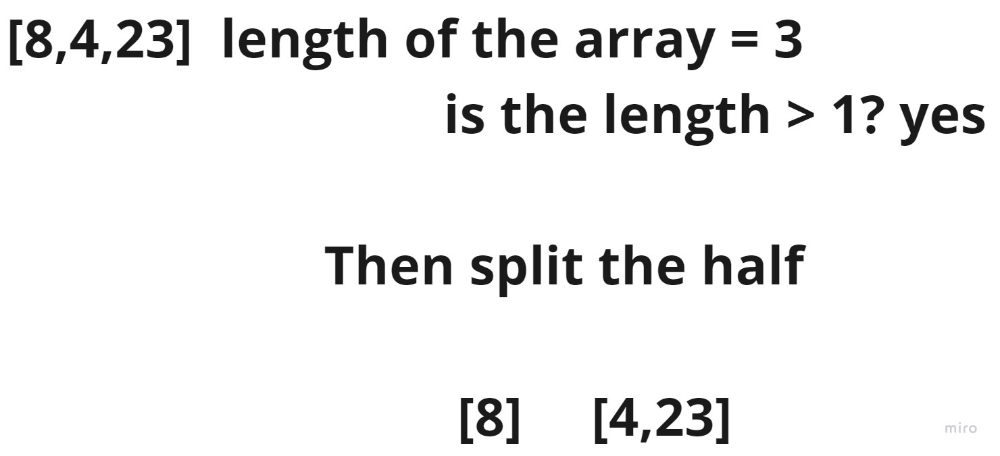
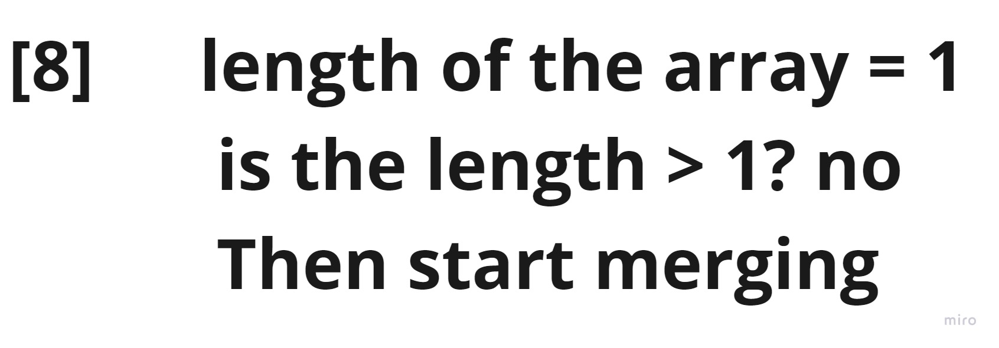
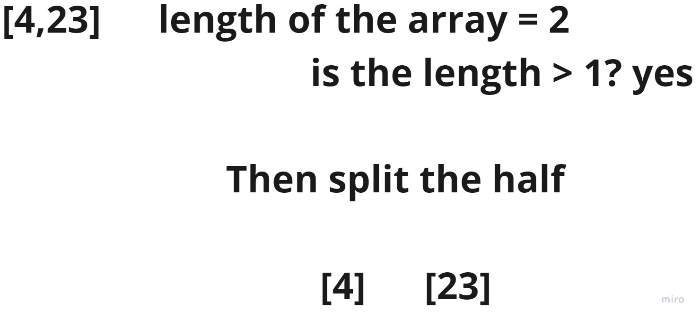
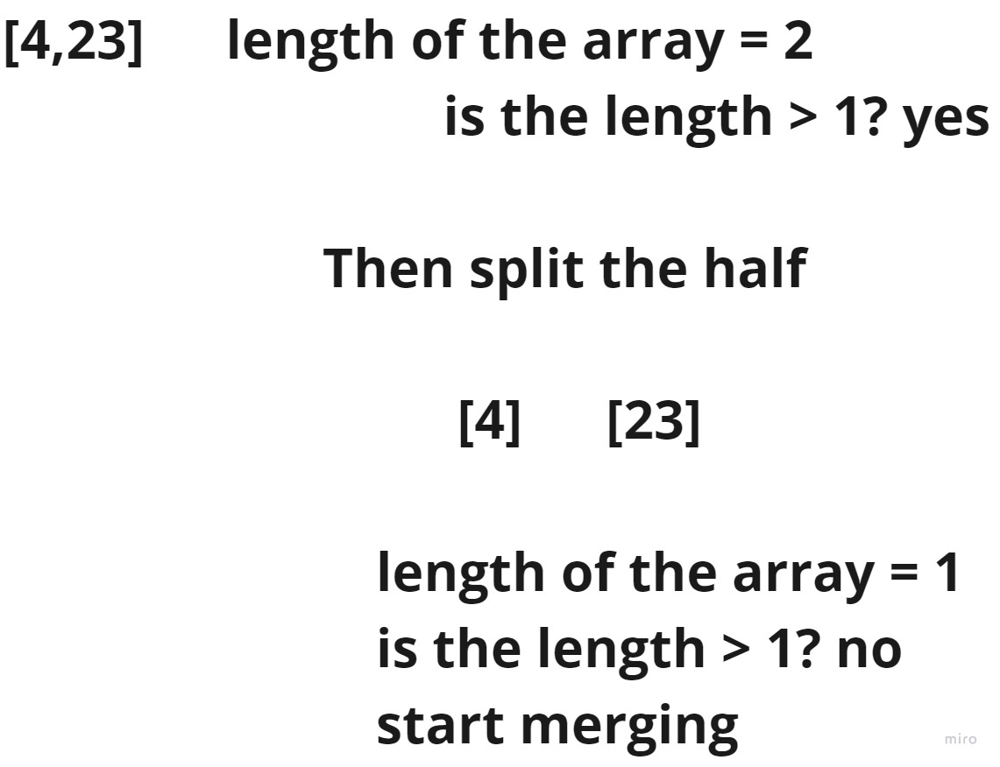
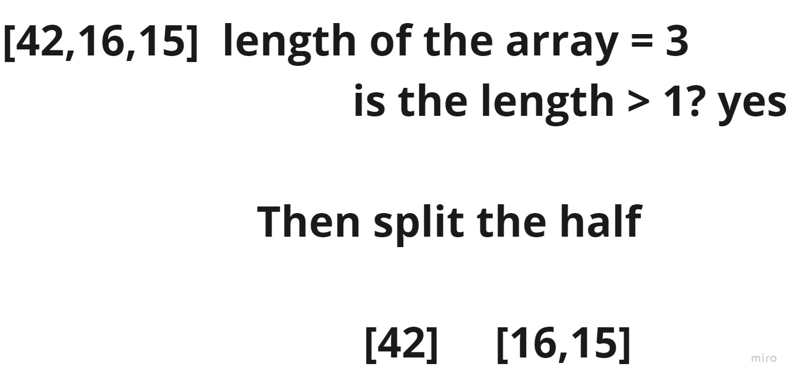
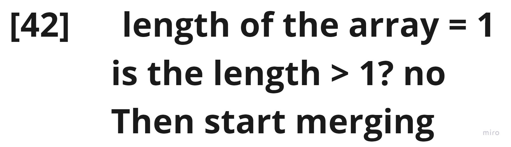
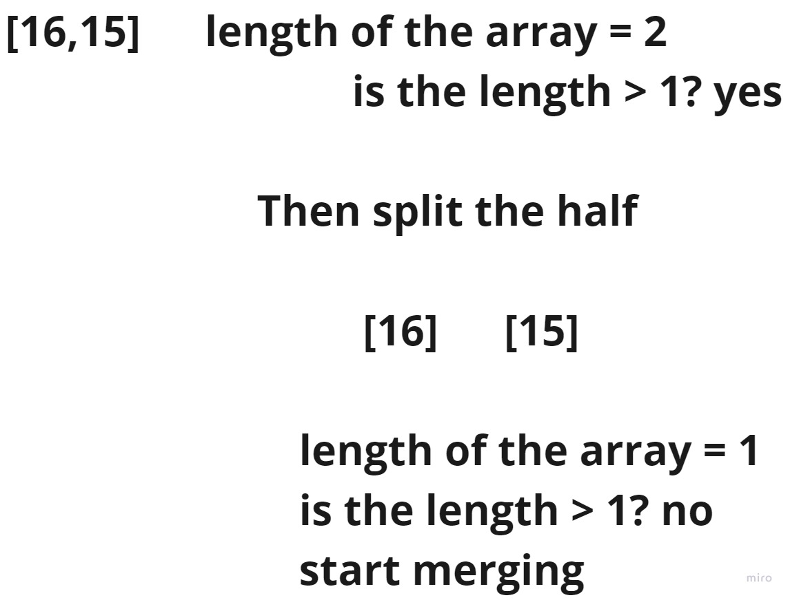

## Merge Sort
The Merge Sort algorithm is a sorting algorithm that is considered an example of the divide and conquer strategy.
So, in this algorithm, the array is initially divided into two equal halves and then they are combined in a sorted manner.

### Trace

Sample Array: [8,4,23,42,16,15]

For this sorting algorithm we are going to be using mainly recursion, so we are going to be tracing recursion steps
for the function, and according to the code we are always going to start from the left.

- Note: Once the size of the subarray becomes 1, the merge processes come into action and start merging arrays back till the complete array is merged.

#### Steps:
- Step1:

The general rule happens in this step, whenever the length of the array is more than 1, that means we are going to split.

- Step2:

In this step we have taken the left half of the array, and as you can see the array is more than 1 so we are splitting it.

- Step3:

The new array have only one element, and that calls for merge, but as we have nothing to compare and merge it will remain the same.

- Step4:

Because we are done with the left side in the last step, we are going now for the right side, and the new array is more than 1, which means we are going to split.

- Step5:

Checking the number of elements on the left and right, and because they are both not more than 1, that means that we are going to compare, sort and merge.

- Step6:

### [4,8,23]
Compare, sort and merge.

- Step7:

Now we are done with the left side in the previous steps, now it's time to go for the right side, starting with getting the
right half of the original array as a new array, and because it is more than 1, we need to split it.

- Step8:

As usual, we will start from the left, and because the new array have one element, we call the merge and nothing change
because there is only one element.

- Step9:

To the right side we go and there are to elements, meaning we need to split, and then we can see again that it's time for checking the number of elements, and after that we compare, sort and merge.

- Step10:

### [15,16,42]
Compare, sort and merge.

- Step11:

### [4,8,15,16,23,42]
Now it's time for the final step which is comparing, sorting and merging the results for both sides, to get the final result, which is what we need.
