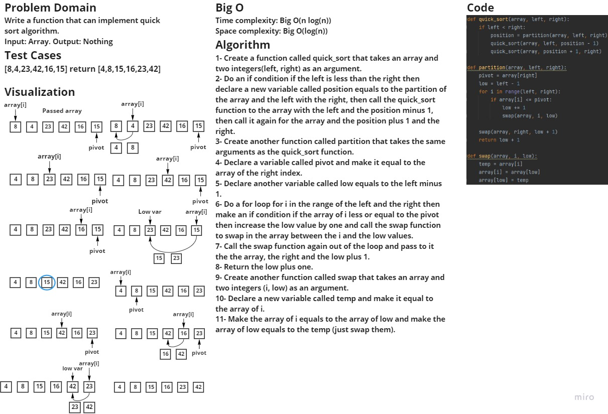

### Challenge
Write a function that would implement quick sort algorithm.

### Whiteboard process:

## Approach & Efficiency
Time complexity: Big O(n log(n))
Space complexity: Big O(log(n))

### Solution
In order to run the code enter "python .\sorting\quick\quick.py"
In order to run the tests enter "pytest .\tests\test_quick.py"
