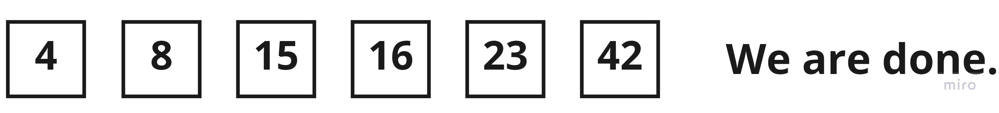

## quick Sort
 It picks an element as a pivot and partitions the given array around the picked pivot. The target of partitions is,
 given an array and an element x of an array as the pivot, put x at its correct position in a sorted array and put
 all smaller elements (smaller than x) before x, and put all greater elements (greater than x) after x.

### Trace

Sample Array: [8,4,23,42,16,15]

### Notes:
- At first the right variable is equal to (len(array) - 1), and the left variable is equal to 0.
- The pivot is equal to array[right].
- The value of the low variable always starts at left variable value - 1.
- When array[i] < the pivot, that means that we are going to increase the low variable by one, and swap we will swap
the i value with the low variable.
- When the i variable is equal to the right variable, that means that the low variable will increase by one, and we 
will swap the i value with the low variable.

#### Steps:
- Step1:

We started to compare array[i] to the pivot, and because the value of array[i] < pivot it's going to get swapped, but
it's the first element and low variable is -1, we will go increase the low variable and go to the next iteration.

- Step2:

Value of array[i] is less than the pivot, so we are going to increase the low variable by one and swap the elements,
after that we go to the next iteration.

- Step3:

The value of array[i] is more than the pivot, so we skip to the next iteration.

- Step4:

Same as previous step.

- Step5:

Same as previous two steps.

- Step6:

The i variable is equal to the right variable, so we are going to increase the low variable and swap elements.

- Step7:

Start the previous process for the left and right of the pivot, lets start with the left first, like the code.

- Step8:

Recursion calls starting to work, the first thing we do is starting to sort the left side from the first pivot, 
so the sorting method is called but this time we will send left = 0 and right = first low - 1, but we are going 
to skip this side of the operation as it is already sorted and nothing is going to change.

- Step9:

The sorting method will be called on the right side and we will give it left = first low from the first set of iterations + 1 
and right = len(array) - 1, we started to compare the pivot and array[i] value, which is not less in this iteration,
so we are skipping.

- Step10:

On the other side, the array[i] value is less than the pivot, so we are going increase the low value by one and swap.

- Step11:

Because the i variable has reached the right variable, we are going to swap the pivot with the array[i] value.

- Step12:

Now we have a sorted array, using the quick sort algorithm.

