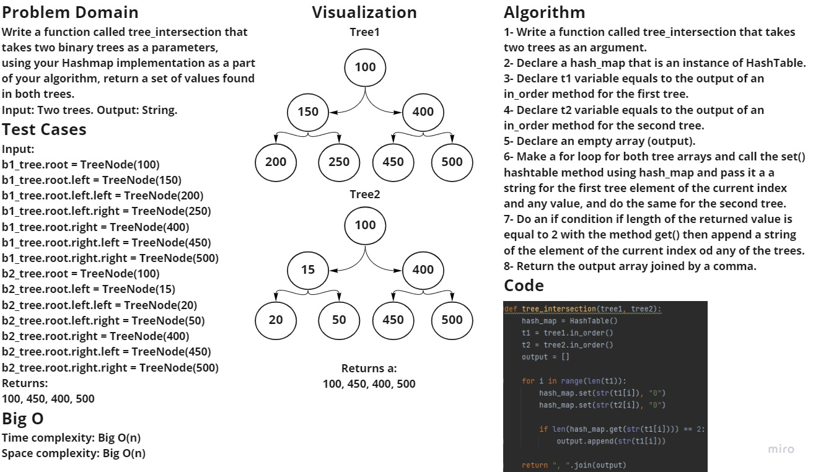

### Challenge summary  
Write a function called tree_intersection that takes two binary trees as a parameters, 
using your Hashmap implementation as a part of your algorithm, return a set of values found in both trees.

### Whiteboard process

### Approach & Efficiency
Time complexity: Big O(n).
Space complexity: Big O(n).

### Solution
To run the code enter "python .\tree_intersection\tree_intersection.py"
To run the tests enter "pytest .\tests\test_tree_intersection.py"