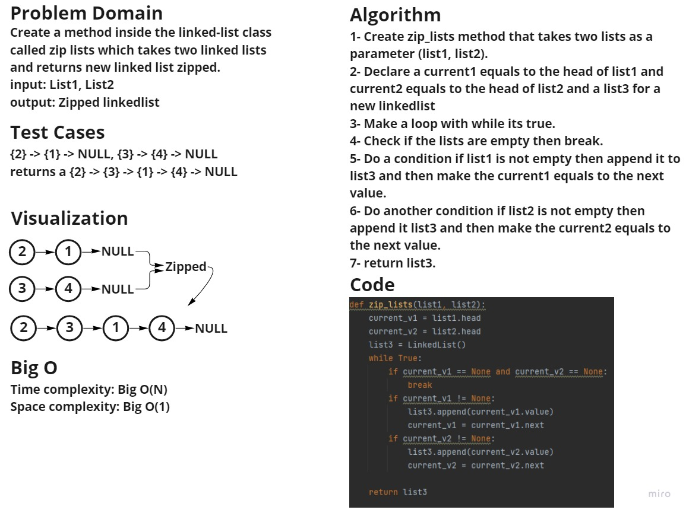

## Challenge Summary:
Write a function called zip_lists which takes two linked lists as arguments. Zip the two linked lists together
into one so that the nodes alternate between the two lists and return a reference to the head of the zipped list.
## Whiteboard process:

## Approach & Efficiency
Time complexity: Big O(N)
Space complexity: Big O(1)

